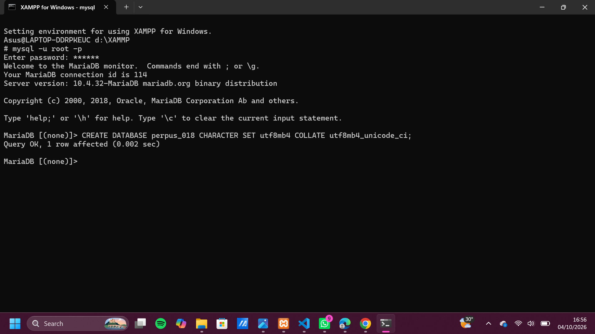

# Laporan Praktikum Basis Data - Pertemuan 1

**Nama:** Zalfa  
**NP M:** 25430018  
**Kelas:** A 
**Tanggal:** 4 Oktober 2026  

## 1. Tujuan Praktikum

Praktikum ini bertujuan untuk menyiapkan lingkungan kerja basis data MariaDB di XAMPP dan mengonfigurasi database `pustaka_018` dengan enkoding `utf8mb4` guna menjamin keamanan penyimpanan karakter teks secara presisi.

Selain itu, praktikum ini menerapkan konsep keamanan dasar *Principle of Least Privilege* dengan membuat akun pengguna khusus (`zalfa_018`) yang hak aksesnya dibatasi pada database utama (`pustaka_018`), sekaligus menguji isolasi hak akses agar database `kopma_018` tidak dapat diakses tanpa izin.

Praktikum ini juga melatih pengelolaan berkas proyek menggunakan sistem kontrol versi Git dan GitHub untuk mengunggah proyek ke repositori remote, sembari melindungi berkas kredensial rahasia dari publik melalui konfigurasi `.gitignore`.

## 2. Ringkasan Dasar Teori

Basis data merupakan sekumpulan data terstruktur yang saling terhubung dan dirancang untuk memfasilitasi penggunaan bersama oleh berbagai pengguna maupun aplikasi. Pengelolaan basis data ini dilakukan secara terpusat menggunakan Database Management System (DBMS). 

DBMS berperan penting sebagai perantara yang menangani manajemen berkas, kontrol akses bersamaan (concurrency control), serta pemulihan data saat terjadi kegagalan sistem. Dengan adanya DBMS, pengembang aplikasi dapat fokus pada manipulasi data menggunakan bahasa SQL tanpa harus membangun mekanisme penyimpanan data dari awal.

## 3. Hasil Langkah Percobaan

### 3.1 Pembuatan Basis Data Proyek

Basis data proyek untuk sistem perpustakaan dibuat dengan nama `perpus_018`. Pada proses pembuatannya, digunakan pengaturan karakter set `utf8mb4` serta collation `utf8mb4_unicode_ci`.

Perintah SQL yang dijalankan:

```sql
CREATE DATABASE perpus_018
CHARACTER SET utf8mb4
COLLATE utf8mb4_unicode_ci;
```

**Hasil;**



*Gambar 3.1 Proses pembuatan database perpus_018 di MariaDB.*