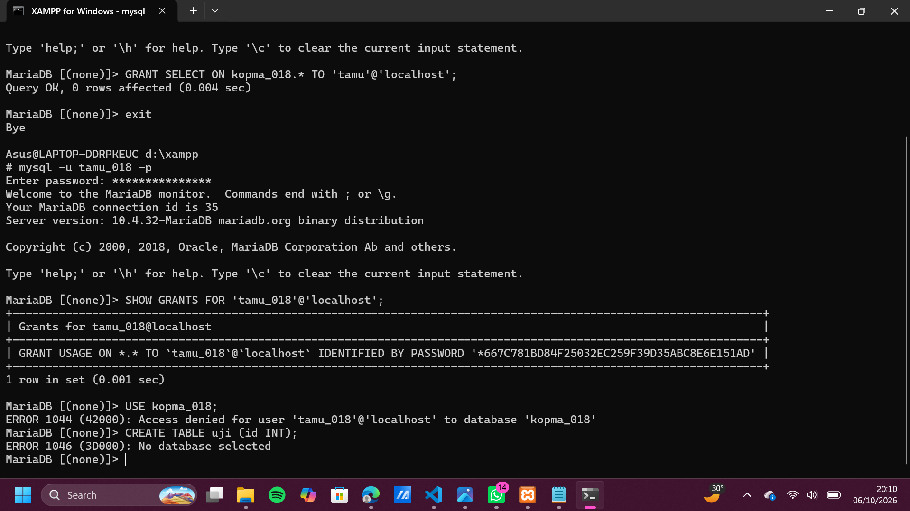

# Laporan Praktikum Basis Data - Pertemuan 1

**Nama:** Zalfa  
**NP M:** 25430018  
**Kelas:** A 
**Tanggal:** 6 Oktober 2026  

## 1. Tujuan Praktikum

Mengenal dan mengoperasikan lingkungan kerja basis data MariaDB/MySQL melalui terminal (CLI) maupun GUI (phpMyAdmin).
Memahami dan mengimplementasikan perintah dasar Data Definition Language (DDL) untuk membuat serta mengelola basis data perpustakaan.
Mengatur hak akses dan keamanan basis data berbasis prinsip *least privilege* dengan membuat akun pengguna khusus (`dev_018`).
Mengintegrasikan repositori lokal ke GitHub serta mengonfigurasi berkas `.gitignore` dan `README.md` untuk pengelolaan proyek basis data secara terstruktur.

## 2. Ringkasan Dasar Teori

Basis data merupakan sekumpulan data terstruktur yang saling terhubung dan dirancang untuk memfasilitasi penggunaan bersama oleh berbagai pengguna maupun aplikasi. Pengelolaan basis data ini dilakukan secara terpusat menggunakan Database Management System (DBMS). 

DBMS berperan penting sebagai perantara yang menangani manajemen berkas, kontrol akses bersamaan (concurrency control), serta pemulihan data saat terjadi kegagalan sistem. Dengan adanya DBMS, pengembang aplikasi dapat fokus pada manipulasi data menggunakan bahasa SQL tanpa harus membangun mekanisme penyimpanan data dari awal.

## 3. Hasil Langkah Percobaan

ganti `<3d>` dengan tiga digit terakhir NPM

### 3.1 Menjalankan Shell XAMPP dan Login MariaDB sebagai root

Membuat koneksi ke server MariaDB

```bash
mysql -u root;
```

*Hasil*


Gambar 3.1 Hasil login MariaDB sebagai root.

### 3.2 Mengamankan Akun root

Daftar akun root diperiksa terlebih dahulu, lalu setiap akun yang ada diberi password.

```sql
SELECT User, Host FROM mysql.user WHERE User = 'root';
ALTER USER 'root'@'localhost' IDENTIFIED BY '<password_root>';
ALTER USER 'root'@'127.0.0.1' IDENTIFIED BY '<password_root>';
ALTER USER 'root'@'::1'       IDENTIFIED BY '<password_root>';
```


Gambar 3.2 Hasil login root dengan opsi -p


Gambar 3.3 Hasil login root tanpa opsi -p

### 3.3 Membuat Basis Data dan Akun Kerja

```sql
CREATE DATABASE kopma_<3d>
  CHARACTER SET utf8mb4 COLLATE utf8mb4_unicode_ci;
CREATE USER 'mhs_<3d>'@'localhost' IDENTIFIED BY '<password_kerja>';
GRANT ALL PRIVILEGES ON kopma_<3d>.* TO 'mhs_<3d>'@'localhost';
SHOW GRANTS FOR 'mhs_<3d>'@'localhost';
```


Gambar 3.4 Hasil SHOW GRANTS

Kemudian masuk sebagai akun kerja dan memeriksa apa yang dapat diakses.

```sql
mysql -u mhs_<3d> -p
SELECT VERSION(), CURRENT_USER();
SELECT @@sql_mode;
SHOW DATABASES;
USE mysql;
```


### 3.4 Menggunakan phpMyAdmin dengan Aman

Apache dijalankan, masuk pada `config.inc.php` lalu pada `$cfg['Servers'][$i]['auth_type'] = 'confic';` diubah bagian `'config'` menjadi `'cookie'` agar phpMyAdmin meminta login.


## 4. Jawaban Titik Analisis

### Titik Analisis 1

Konsekuensi mencari solusi di internet adalah berisiko salah penanganan karena sintaks dan fitur MySQL modern (seperti versi 8.0) sering tidak cocok dengan MariaDB, sehingga dokumentasi MySQL hanya relevan untuk perintah SQL dasar `(SELECT, INSERT, CREATE TABLE)` dan login CLI, sedangkan dokumentasi MariaDB wajib dirujuk saat mengedit konfigurasi `my.ini`, mengatur `sql_mode`, mengelola privileges user, serta menangani galat spesifik server.

### Titik Analisis 2

Pesan galat yang muncul `ERROR 1045 (28000): Access denied for user 'root'@'localhost' (using password: NO)`. Bagian  yang memberi tahu bahwa klien tidak mengirim password adalah `(using password: NO)`.

### Titik Analisis 3

`information_schema` tetap terlihat karena hanya berisi metadata sistem dasar yang aman diakses semua user, sedangkan database mysql ditolak dengan `ERROR 1044 (Access Denied)` karena berisi data keamanan sensitif milik administrator (root). Perbedaannya, ERROR 1044 adalah gagal mengakses database tertentu akibat kurang hak akses, sementara ERROR 1045 adalah gagal login ke server dari awal akibat salah username atau password

### Titik Analisis 4

Mode `cookie` lebih aman karena password hanya disimpan sementara di peramban web dan langsung hilang saat logout, sedangkan mode `config` menyimpan password secara permanen dalam bentuk teks polos di berkas `config.inc.php` server yang rentan tercuri jika server diretas.

## 5. Hasil Latihan dan Modifikasi

ganti `<3d>` dengan tiga digit terakhir NIM

### Latihan 1: Akun tamu dengan hak SELECT saja

Akun `tamu_<3d>` dibuat sebagai root dan hanya diberi hak `SELECT` pada `kopma_<3d>`.

```sql
CREATE USER 'tamu_<3d>'@'localhost' IDENTIFIED BY '<password_tamu>';
GRANT SELECT ON kopma_<3d>.* TO 'tamu_<3d>'@'localhost';
SHOW GRANTS FOR 'tamu_<3d>'@'localhost';
```


Kemudian masuk sebagai `tamu_018`, memilih basis data, dan mencoba membuat tabel.

```sql
mysql -u tamu_<3d> -p
USE kopma_<3d>;
CREATE TABLE uji (id INT);
```

*Hasil*


### Latihan 2: Skrip yang dapat dijalankan berulang

Skrip `p01_lingkungan_<NIM>.sql` diubah dengan `IF NOT EXISTS` supaya tidak galat bila basis data atau akun sudah ada.

**Sebelum:**

```sql
CREATE DATABASE kopma_<3d>
  CHARACTER SET utf8mb4 COLLATE utf8mb4_unicode_ci;
CREATE USER 'mhs_<3d>'@'localhost' IDENTIFIED BY '<password_kerja>';
GRANT ALL PRIVILEGES ON kopma_<3d>.* TO 'mhs_<3d>'@'localhost';
```

**Sesudah:**

```sql
CREATE DATABASE IF NOT EXISTS kopma_<3d>
  CHARACTER SET utf8mb4 COLLATE utf8mb4_unicode_ci;
CREATE USER IF NOT EXISTS 'mhs_<3d>'@'localhost' IDENTIFIED BY '<password_kerja>';
GRANT ALL PRIVILEGES ON kopma_<3d>.* TO 'mhs_<3d>'@'localhost';
```


Skrip dijalankan **dua kali** dari Command Prompt

```
mysql -u root -p < p01_lingkungan_<NIM>.sql
mysql -u root -p < p01_lingkungan_<NIM>.sql
```


**Keterangan:**
- Hasil pada eksekusi pertama: tidaak ada galat
- Hasil pada eksekusi kedua: tidak ada galat
- Mengapa `GRANT` tidak perlu diubah: karena `GRANT` hanya memperbarui atau memastikan hak akses tersebut tetap berlaku bagi pengguna
- Apa yang terjadi pada password akun yang sudah ada saat skrip dijalankan ulang: password akun tidak akan berubah, karena `IF NOT EXISTS` membuat perintah `CREATE USER` dilewati sepenuhnya oleh MariaDB jika akun pengguna tersebut sudah ada.

## 6. Tugas Mandiri. Milestone Proyek 1
* *Deskripsi Milestone:*
* Target pada milestone ini adalah menyiapkan lingkungan kerja awal untuk proyek pribadi berbasis dua digit terakhir NIM (NIM: 25430018, Tema: Perpustakaan, Kode Tema: perpustakaan). Membuat basis data proyek perpustakaan_018 dengan konfigurasi character set utf8mb4. Membuat akun pengguna kerja dev_018 dengan hak akses terbatas, khusus untuk database perpustakaan_018. Mengisi identitas proyek pada berkas README.md, yaitu organisasi fiktif "Perpustakaan Parable", tema, dan cakupan layanan. Menambahkan berkas .gitignore untuk mencegah terunggahnya kredensial sensitif. Melakukan pengiriman awal ke repositori GitHub basisdata_25430018.

## 7. Pembahasan dan Kendala
* *Pembahasan:* Pada praktikum ini, perintah DDL berhasil membentuk struktur basis data perpustakaan dan lingkungan proyek sistem pustaka. Penentuan tipe data seperti INT untuk ID atau jumlah stok buku, VARCHAR untuk teks dinamis seperti judul dan nama anggota, serta DATE untuk tanggal peminjaman sudah sesuai dengan aturan perancangan basis data relasional. Penerapan integrity constraint seperti PRIMARY KEY dan FOREIGN KEY menjaga konsistensi relasi antar-tabel. Pada konfigurasi pengguna, penerapannya sudah sesuai dengan prinsip keamanan least privilege. Akun dev_018 hanya mendapat hak akses pada database perpus_018 untuk mencegah pengaksesan atau modifikasi tidak sah pada database lain (seperti kopma_018).
* *Kendala dan Solusi:*
* Kendala 1: Saat menjalankan ulang skrip SQL pembuatan basis data dan pengguna, muncul eror galat karena objek perpus_018 dan akun dev_018 sudah terdaftar di sistem.
Solusi: Menambahkan klausa IF NOT EXISTS pada perintah CREATE DATABASE dan CREATE USER agar skrip dapat dijalankan berulang kali tanpa timbul galat.
* Kendala 2: Kendala 2: Akun dev_018 sempat tidak bisa mengakses atau hak aksesnya belum aktif secara langsung setelah dibuat lewat skrip.
Solusi: Menambahkan perintah FLUSH PRIVILEGES; di akhir skrip SQL agar MariaDB langsung memperbarui tabel hak akses sistem secara penuh.

## 8. Kesimpulan
Praktikum Modul 1 berhasil mengenalkan lingkungan kerja MariaDB/MySQL melalui terminal CLI maupun GUI phpMyAdmin, serta penggunaan perintah Data Definition Language (DDL) untuk mengelola struktur database dan tabel perpustakaan. Pemilihan tipe data yang presisi dan penerapan constraint (PRIMARY KEY, FOREIGN KEY, NOT NULL, UNIQUE) sangat penting untuk menjaga integritas, keamanan, dan keabsahan relasi data perpustakaan. Penerapan hak akses akun kerja berbasis least privilege pada akun dev_018 serta integrasi Git/GitHub (.gitignore dan README.md) mendukung pengelolaan proyek basis data yang terstruktur, aman, dan dapat dilacak dengan baik.

## 9. Pernyataan Penggunaan AI
Dengan ini saya menyatakan bahwa saya menggunakan* bantuan Artificial Intelligence (sebagai alat bantu pemahaman atau pengecekan kode), dengan tetap bertanggung jawab penuh atas seluruh isi, analisis, dan kode program yang dikumpulkan dalam laporan praktikum ini.

## 10. Bukti Git                   
* *Link Repositori:* [https://github.com/zalfazahiraaa/basisdata_25430018]
* *Tangkapan Layar Git Log / Commit:*
